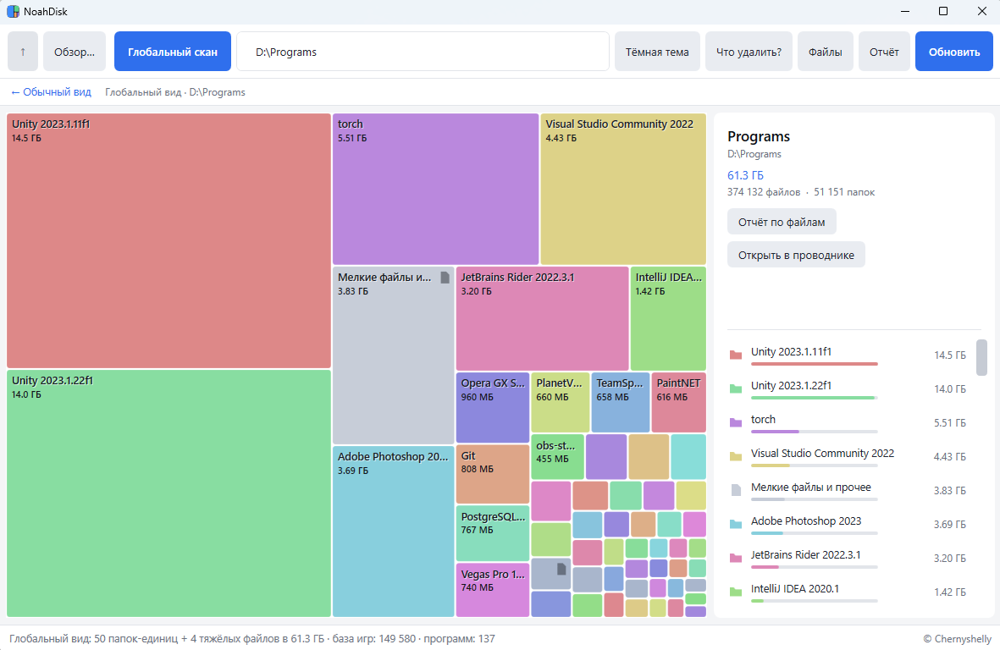

# NoahDisk

Автор: **Chernyshelly** · [github.com/ChernyshellyOfficial](https://github.com/ChernyshellyOfficial)

Утилита для Windows: указываешь папку — видишь, **куда девается место**.



**⬇ [Скачать NoahDisk — портативный `.exe`](https://github.com/ChernyshellyOfficial/NoahDisk/releases/latest)** — скачал и запустил, установка и рантайм не нужны.

Две версии с общим движком сканирования (`Scanner.cs`):

- **GUI** (`gui/`) — десктоп-приложение с treemap-визуализацией.
- **Консоль** (корень) — текстовый отчёт, можно гонять из терминала и скриптов.

---

## GUI-версия (красивая)

- **Глобальный скан** — кнопка «Глобальный скан»: полностью сканирует папку и **раскладывает всё значимое в один вид** — отдельные игры (в т.ч. из `steam/steamapps/common`), программы, тяжёлые файлы, как бы глубоко они ни лежали. Спускается сквозь папки-контейнеры и всплывает настоящими «единицами». Хлебные крошки «← Обычный вид» возвращают назад; двойной клик по элементу — перейти к нему; правый клик по плитке **«Мелкие файлы и прочее» → «Показать содержимое»** раскрывает, из чего этот хвост состоит. Предупреждает, что для целого диска это дольше обычного.
  - **Возврат в глобальный вид без пере-скана.** Результат скана держится в памяти: если провалиться в папку (перейти к элементу), в хлебных крошках появляется кнопка **«← Глобальный вид»** — она мгновенно возвращает к разложенному виду, не сканируя диск заново. Работает в обе стороны: «← Обычный вид» ↔ «← Глобальный вид».
  - **Галочка «узнавать по базам имён».** В диалоге запуска можно **отключить** использование баз (реестр установленных программ, Steam, Chocolatey) — тогда раскладка будет чисто по структуре папок. Полезно, если в реестре что-то помечено неверно. По умолчанию включено; при выключении в статусе видно «базы имён выкл.».
  - **Встроенная база названий игр.** Чтобы узнавать игры и не дробить их на внутренние папки (`Content`, `Paks`, `DataA`/`DataB`…), в программу **зашит снимок списка приложений Steam** (~150 тыс. названий, gzip ≈1 МБ внутри exe). Имена нормализуются (только буквы/цифры, нижний регистр) и матчатся по префиксу от ≥8 символов — поэтому `Core Keeper v1.0.0.10` узнаётся как `Core Keeper`, а `Metal Gear Rising - Revengeance` — как `METAL GEAR RISING: REVENGEANCE`, и папка показывается целиком. **Всё работает офлайн, интернет не нужен** (официальный Steam API в ряде сетей недоступен, поэтому список именно встроен, а не качается). В статусе внизу видно «база игр: N». Обновить список можно пересборкой (скрипт `tools/update-gamedb` тянет свежий снимок и перепаковывает `gui/steam_names.txt.gz`).
  - **Распознавание программ** — два слоя, оба офлайн:
    1. **Реестр установленных программ** (основной). Читает `InstallLocation` из ключей Uninstall — так папка узнаётся *по точному пути* и показывается **с правильным именем** (`System Informer`, а не папка `ProcHack`; `Mozilla Firefox`, а не `Firefox`). Ноль ложных срабатываний, всегда актуально, ничего не вшито. Заодно ловит и зарегистрированные игры. Широкие расположения (`Program Files`, `…\steamapps\common`) в расчёт не идут. В статусе видно «программ: N».
    2. **Встроенный список имён программ** (снимок Chocolatey, ~1.5 тыс., gzip ≈11 КБ) — для **портативных/незарегистрированных** программ по имени папки (`OBS Studio`, `qBittorrent`, `HandBrake`…), тем же префиксным матчингом ≥8 символов. Короткие имена (`VLC`, `Git`, `Blender`) намеренно не в списке — их надёжно закрывает реестр. Обновляется скриптом `tools/update-programdb.ps1`.
- **Treemap**: каждый прямоугольник — папка или файл, площадь ∝ размеру. Сразу видно, что «весит».
- **Файлы видны отдельно** от папок: приглушённый стальной цвет + иконка‑документ (в списке — своя иконка для папки и для файла). Двойной клик по файлу — открыть его в проводнике.
- **Двойной клик** по плитке — проваливаешься внутрь; **правый клик** — контекстное меню; **Backspace** — вверх.
- **Хлебные крошки** сверху — быстрый возврат на любой уровень.
- **Боковая панель**: детали выбранного (размер, % от текущей папки, файлы/папки, «Открыть в проводнике») и список подпапок с мини-барами.
- **Светлая и тёмная тема** — кнопка «Тема» в панели сверху. Тема охватывает все окна, кнопки, поля, списки и даже полосу заголовка окна (тёмная через DWM, нативное поведение окна сохраняется).
- **Отчёт** — кнопка «Отчёт»: визуальная сводка с группами папок по размеру, цветными барами и процентами. В каждой группе видно счётчик, сумму, процент и **медиану** размера папки; по умолчанию показаны 4 папки, «Показать ещё N» разворачивает остальные. Внизу — «Копировать текст» (та же сводка простым текстом).
- **Файлы** — кнопка «Файлы»: отчёт по файлам всей текущей папки (с подпапками) — распределение по размеру (огромные / крупные / средние / небольшие / мелкие) со счётчиками, суммами, медианой и барами, разбивка **по типам файлов** (расширениям) и список **крупнейших файлов**. Тот же отчёт по любой папке — **правый клик по её плитке → «Отчёт по файлам»**.
- **Что удалить?** — кнопка «Что удалить?»: указываешь, сколько свободного места хочешь иметь на диске — выбором из списка (50/100/200/300 ГБ…) или вручную («75 ГБ», «1 ТБ»). Программа вычитает текущее свободное место и даёт **3 плана** освобождения из элементов текущего вида (папок **и** файлов — в т.ч. тяжёлых файлов из глобального скана; с учётом свёрток):
  1. **минимум элементов** — 1–2 самых крупных, чтобы закрыть цель сразу;
  2. **несколько средних**;
  3. **много мелких** (не трогая крупные).

  Для каждого плана — список с путями, сколько освободит и «станет свободно ≈». У каждого пункта есть «Открыть в проводнике» (откроет и выделит папку/файл, чтобы сразу удалить). Программа **ничего не удаляет** сама — только подсказывает.
- **Открыть папку**: «Обзор…», перетаскивание в окно, путь + Enter, или `NoahDisk.exe "D:\"` — скан стартует сразу.
- **«Обновить»** — перечитать текущую папку с диска, сохранив свёртки и позицию навигации.
- Детали папки показываются **по клику** по плитке или строке списка.

### Умная развёртка

Допустим, в `Games` лежат папки с играми и папка `Steam`. Внутри `Steam` ~весь объём — это
`steamapps\common`, где и лежат игры. Выдели `Steam` и нажми **«Умное добавление к расчётам»**
(кнопка в панели справа или правый клик по плитке): программа спускается по доминирующей цепочке
(`Steam → steamapps → common`), пока вес не разделится на значимые доли, и подмешивает найденные
папки-игры прямо в список `Games` — вместо одной плитки `Steam`. Так игры из `common` сравниваются
на равных с играми, лежащими в `Games` напрямую. Остаток (`Steam` минус подмешанное) показывается
отдельной плиткой «Steam — остаток». (Название «остаток» — чтобы не путать со сводной плиткой
«Мелкие файлы и прочее» в глобальном скане: та собирает всё мелкое по диску, а «— остаток» — это
неразложенный хвост одной конкретной развёрнутой папки.)

Отменить: выдели плитку-остаток → «Свернуть обратно», или кнопка «Сбросить свёртки».
Свёртки **переживают «Обновить»** (привязаны к путям).

**Запуск:** портативный `.exe` из [releases](https://github.com/ChernyshellyOfficial/NoahDisk/releases/latest) — двойной клик, рантайм не нужен. Собранный из исходников `NoahDisk.exe` (см. «Сборка из исходников») требует установленный **.NET 9 Desktop Runtime**.

### При первом запуске Windows может предупредить — это нормально

Программа **не подписана** сертификатом (подпись стоит денег), поэтому Windows видит «неизвестного издателя»:

- **SmartScreen** покажет синее окно «Система Windows защитила ваш компьютер». Нажми **«Подробнее»** → **«Выполнить в любом случае»**.
- Некоторые антивирусы могут насторожиться на self-contained exe (он распаковывает рантайм .NET во временную папку) — это ложное срабатывание, не вирус.

Программа только читает оглавление диска (имена и размеры) и **ничего не удаляет и никуда не отправляет** — работает полностью офлайн.

---

## Консольная версия

Собирается из исходников (см. «Сборка из исходников») — `dotnet publish -o dist` даёт `dist\NoahDisk.exe`.

```powershell
NoahDisk.exe "D:\"
NoahDisk.exe "C:\Users\Me\Downloads" --depth 4 --top 20
```

Или перетащи папку на `NoahDisk.exe`. Без аргумента — спросит путь.

Показывает: распределение по размеру (крупные папки по тирам списком, мелкие < 1 ГБ — «хвостом»),
дерево «тяжёлых веток» и топ крупнейших папок.

| Опция         | Что делает                                              |
|---------------|---------------------------------------------------------|
| `--depth N`   | глубина дерева тяжёлых веток (по умолчанию `3`, `0` — выкл.) |
| `--top N`     | сколько крупнейших папок показать (по умолчанию `12`)   |
| `--no-tree`   | не показывать дерево                                     |
| `--no-top`    | не показывать список крупнейших папок                   |
| `-h`, `--help`| справка                                                 |

---

## Что под капотом

- Параллельный обход (`Parallel.For` по папкам верхнего уровня) — ~800 ГБ / 700k файлов за ~3 с на SSD.
- Пропускает **junction/симлинки** (`ReparsePoint`), чтобы не зацикливаться и не считать дважды.
- Папки без доступа и ошибки чтения не роняют скан — сводятся в строку «пропущено».
- Размеры — двоичные (1 КБ = 1024 Б).
- Treemap — алгоритм *squarified treemap* (Bruls, Huizing, van Wijk): плитки с близким к квадрату соотношением сторон.

## Структура

```
NoahDisk/
  Scanner.cs            движок сканирования (DirNode, Scanner, ScanStats, Format)
  Analysis.cs           умная развёртка (SmartUnwrap) — чистая логика, покрыта тестами
  TextReport.cs         текстовый отчёт (группировка/дерево/топ) — общий для консоли и GUI
  Program.cs            консольная версия
  NoahDisk.csproj
  gui/
    NoahDisk.Gui.csproj
    App.xaml(.cs)
    MainWindow.xaml(.cs)  окно, темы, навигация, развёртка, отчёт
    TreemapView.cs        кастомный treemap-контрол (слайсы + тема)
  tests/
    NoahDisk.Tests.csproj  мини-тесты SmartUnwrap (dotnet run --project tests)
  tools/                скрипты пересборки встроенных баз имён (Steam, Chocolatey)
```

## Сборка из исходников

Нужен **.NET 9 SDK**.

```powershell
# консоль
dotnet run -- "D:\"
dotnet publish -c Release -o dist

# GUI
dotnet run --project gui
dotnet publish gui -c Release -o dist-gui

# портативный GUI одним файлом (не нужен установленный .NET; первый раз нужен доступ к NuGet)
# запускать из корня проекта (где лежит папка gui); или просто дважды кликнуть build-portable.cmd
dotnet publish gui -c Release -r win-x64 --self-contained true -p:PublishSingleFile=true -p:IncludeNativeLibrariesForSelfExtract=true -p:EnableCompressionInSingleFile=true -o dist-gui-portable
```

---

## Лицензия

Свободно распространяемая (freeware) — см. [LICENSE](LICENSE). Коротко: программу можно **бесплатно скачивать, пользоваться и передавать кому угодно** (скидывать друзьям, зеркалить) — лишь бы без изменений, бесплатно и с сохранением авторства. **Продавать, изменять, декомпилировать или встраивать в платные продукты — нельзя** без разрешения автора; право на будущую платную версию автор сохраняет. © Chernyshelly.
